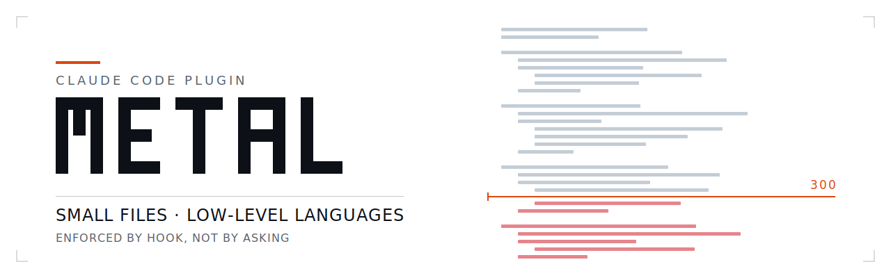

<div align="center">

<picture>
  <source media="(prefers-color-scheme: dark)" srcset="assets/hero-dark.svg">
  <source media="(prefers-color-scheme: light)" srcset="assets/hero-light.svg">
  
</picture>

<br>
<br>

[](https://github.com/MiracleWeb3/metal/actions)
[](LICENSE)
[](#)
[](https://claude.com/claude-code)

<br>

<a href="#rule-1">Rule&nbsp;1</a> &nbsp;·&nbsp; <a href="#rule-2">Rule&nbsp;2</a> &nbsp;·&nbsp; <a href="#install">Install</a> &nbsp;·&nbsp; <a href="#configure">Configure</a> &nbsp;·&nbsp; <a href="#how">How&nbsp;it&nbsp;works</a> &nbsp;·&nbsp; <a href="#why">Why</a>

<br>

**A Claude Code plugin with two rules: small files, low-level languages.**<br>
<sub>One of them is enforced by a hook, not by asking nicely.</sub>

</div>

<br>

---

Every "keep files small" convention dies the same way: it lives in a style guide nobody reads, and the model writes a 900-line module anyway. `metal` moves the rule out of prose and into a `PreToolUse` hook, where the tool call simply fails.

```console
$ # the model attempts to write a 401-line file

  ✗  Write  src/parser.rs   401 lines

     parser.rs is 401 lines; the limit is 300. Split it now, before anything
     else. Make a directory named after the file, give each concern its own
     file, re-export from one entry point (Rust mod.rs, C header, TS index).
     Cut along seams that already exist — parse/emit/state/io — not at an
     arbitrary line.
```

The file is never created. There is nothing to negotiate with.

<br>

<a name="rule-1"></a>

## Rule 1 &nbsp;·&nbsp; No large files

**300 lines. Hard limit.**

```
  before                          after
  ──────────────────────────      ──────────────────────────
  parser.rs      401 lines        parser/
                                  ├── mod.rs       34
                                  ├── lex.rs      112
                                  ├── expr.rs     148
                                  └── error.rs     61
```

Because "split this file" on its own produces garbage, the refusal carries the method with it:

| | |
|:--|:--|
| **Shape** | A directory named after the file. One concern per file. One entry point re-exporting them. |
| **Seams** | Cut where a seam already exists — parse / emit / state / io / errors. Never at an arbitrary line. |
| **Test** | One file, one job. If naming that job takes more than three words, it is two files. |
| **Target** | Eight 80-line files beat one 640-line file. Every file fits on a screen and is findable by name alone. |

### What it does not do

Editing a file that is **already** oversized only warns. A one-line fix to legacy code is not held hostage to a refactor nobody asked for — creating new bloat is blocked, inheriting it is not.

It also stays out of the way of things that aren't source: `.md`, `.json`, data files, and anything under `node_modules/`, `target/`, `vendor/`, `dist/`, `build/`.

<br>

<a name="rule-2"></a>

## Rule 2 &nbsp;·&nbsp; Low-level by default

New code starts at the lowest level that fits the problem.

| | Language | When |
|:--|:--|:--|
| **1** | **Rust** | The default. No GC, errors are values, the compiler rejects at build time what would otherwise be a runtime surprise. |
| **2** | **C** | Freestanding, embedded, tiny binaries, a stable ABI, or existing C to interop with. |
| **3** | **C++** | Only when a mandatory dependency is C++. |
| **4** | **Assembly** | Only for a hot path measured hot. |
| **5** | **Go / Zig** | Only for a library that exists nowhere else. |

This rule cannot be hooked — language choice happens before any tool call exists to intercept. So `SKILL.md` is injected at every `SessionStart` **and** every `SubagentStart`, which means it survives context compaction and reaches delegated subagents that would otherwise reach for Python out of habit.

It does **not** rewrite your existing codebases. It proposes the low-level lane where the pain is actually determinism — parsers, protocols, state machines, concurrency, hot paths — and otherwise leaves them alone.

<br>

<a name="install"></a>

## Install

```
/plugin marketplace add MiracleWeb3/metal
/plugin install metal@metal
```

Or drop it in your skills directory, where it loads with no install step at all:

```
git clone https://github.com/MiracleWeb3/metal ~/.claude/skills/metal
```

> [!NOTE]
> Hooks are read once, at session start. Restart Claude Code after installing or the rules stay dormant.

<br>

<a name="configure"></a>

## Configure

One number, one place:

```python
# hooks/split.py
LIMIT = 300   # keep in sync with SKILL.md
```

Language preference order lives in `SKILL.md` under *Low-level by default*. Both files are meant to be edited — the whole plugin reads in under two minutes.

<br>

<a name="how"></a>

## How it works

```
  Write  src/parser.rs
    │
    ├─  is it source?              .rs                    yes
    ├─  is it vendored or built?   node_modules/ target/    no
    ├─  how many lines?            401                       ─
    └─  over the limit?            401 > 300               yes
            │
            ▼
      PreToolUse returns permissionDecision: "deny"
            │
            ▼
      ✗  the tool call never runs
```

| Event | Fires on | Outcome |
|:--|:--|:--|
| `PreToolUse` | `Write` | **Denies** the call outright — the oversized file is never created |
| `PostToolUse` | `Write` `Edit` | **Warns** via `additionalContext` — the edit lands, the model is told to split |
| `SessionStart` | startup · resume · clear · compact | Injects both rules, so they survive compaction |
| `SubagentStart` | every delegated agent | Injects both rules, so subagents inherit them |

<br>

<a name="why"></a>

## Why low-level

A deterministic language pins down what the machine actually does. High-level runtimes hide GC pauses, dynamic dispatch, implicit allocation and silent coercion — exactly the invisible state that makes a *generated* program unpredictable.

The counterintuitive part: prompting into a low-level language buys **more** control over the result than prompting into a high-level one, even though the code is harder to write by hand. Difficulty of authorship stops being the deciding cost when you are not the one typing. What is left is how much of the machine's behavior the source actually specifies — and there, C and Rust specify far more of it than Python does.

<br>

## Test

```
python3 hooks/split.py --selftest
```

No framework, no fixtures. Eight assertions covering both hook branches, the extension filter, skipped build directories, and the missing-file path. CI runs it on every push, and checks that `split.py` obeys its own 300-line rule.

<details>
<summary><b>Layout</b></summary>

<br>

```
.claude-plugin/plugin.json        manifest
.claude-plugin/marketplace.json   so others can install it
SKILL.md                          both rules, injected every session
hooks/hooks.json                  wiring
hooks/split.py                    the enforcer — 80 lines
assets/                           hero, dark and light
```

</details>

<details>
<summary><b>Design notes</b></summary>

<br>

**Why a hook and not a CLAUDE.md line.** A rule in prose is advice the model weighs against everything else in context, and loses to convenience under pressure. A rule in a `PreToolUse` hook is arithmetic: the line count either exceeds the limit or it doesn't, and the tool call either happens or it doesn't. The only rules that survive a long session are the ones that aren't rules.

**Why deny on create but only warn on edit.** They are different acts. Writing a 900-line file is a choice made in the moment and worth blocking. Touching a 900-line file you inherited is not — blocking it turns every one-line bugfix into a refactor, which is how a tool earns itself an uninstall.

**Why the refusal is verbose.** A bare rejection produces a worse split than no split at all: the model cuts at line 300 and leaves two halves that both make no sense. The message carries the method — name the seams, name the shape, name the test — because the split is the part that has to be right.

**Why 300.** It's arbitrary, and it's supposed to be. It sits just past the point where a file stops fitting in one screen and one head. Change it.

</details>

<br>

---

<div align="center">
<sub>MIT · built for <a href="https://claude.com/claude-code">Claude Code</a></sub>
</div>
