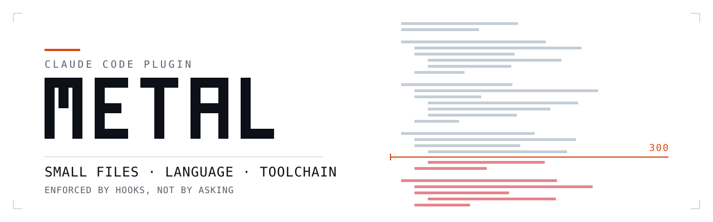

<div align="center">

<picture>
  <source media="(prefers-color-scheme: dark)" srcset="assets/hero-dark.svg">
  <source media="(prefers-color-scheme: light)" srcset="assets/hero-light.svg">
  
</picture>

<br>
<br>

[](https://github.com/MiracleWeb3/metal/actions)
[](LICENSE)
[](#)
[](https://claude.com/claude-code)

<br>

<a href="#why-low-level">Why</a> &nbsp;·&nbsp; <a href="#rule-1--no-large-files">Rule&nbsp;1</a> &nbsp;·&nbsp; <a href="#rule-2--low-level-by-default">Rule&nbsp;2</a> &nbsp;·&nbsp; <a href="#rule-3--the-compiler-refuses">Rule&nbsp;3</a> &nbsp;·&nbsp; <a href="#install">Install</a> &nbsp;·&nbsp; <a href="#configure">Configure</a> &nbsp;·&nbsp; <a href="#how-it-works">How&nbsp;it&nbsp;works</a>

<br>

**A Claude Code plugin with three rules: small files, low-level languages, a compiler that refuses.**<br>
<sub>Two of them are enforced by hooks, not by asking nicely.</sub>

</div>

<br>

---

Every "keep files small" convention dies the same way: it lives in a style guide nobody reads, and the model writes a 900-line module anyway. `metal` moves the rule out of prose and into a `PreToolUse` hook, where the tool call simply fails.

```console
$ # the model attempts to write a 401-line file

  ✗  Write  src/parser.cpp   401 lines

     parser.cpp is 401 lines; the limit is 300. Split it now, before anything
     else. Make a directory named after the file, give each concern its own
     file, re-export from one entry point (C++ header, C header, TS index).
     Cut along seams that already exist — parse/emit/state/io — not at an
     arbitrary line.
     If this file genuinely does not split, say so in it and why:
       // metal: allow 441 - <what makes it one unit>
```

The file is never created. There is nothing to negotiate with.

<br>

## Why low-level

A deterministic language pins down what the machine actually does. High-level runtimes hide GC pauses, dynamic dispatch, implicit allocation and silent coercion — exactly the invisible state that makes a *generated* program unpredictable.

The counterintuitive part: prompting into a low-level language buys **more** control over the result than prompting into a high-level one, even though the code is harder to write by hand. Difficulty of authorship stops being the deciding cost when you are not the one typing. What is left is how much of the machine's behavior the source actually specifies — and there, C and C++ specify far more of it than Python does. This hook is itself the argument: it used to be Python, and a skill that mandates C++ has no business being enforced by an interpreter.

<br>

## Rule 1 &nbsp;·&nbsp; No large files

**300 lines. Hard limit. 220 lines, advisory.**

```
  before                          after
  ──────────────────────────      ──────────────────────────
  parser.cpp     401 lines        parser/
                                  ├── parser.hpp   34
                                  ├── lex.cpp     112
                                  ├── expr.cpp    148
                                  └── error.cpp    61
```

**The advisory is the useful half.** At 301 the deny lands when it is already too late to split well: you cut wherever you happen to be standing. So the hook speaks at 220, while there are still 80 lines of runway to find a real seam. Measured across 109 authored files — median 78, p90 202 — it fires on about 8% of them, and the ones that used to reach the ceiling had piled up at 289, 296, 299, squeezed under the limit rather than split.

**One file in a hundred genuinely does not split** — a lexer, a transition table, a generated parser. Forcing those produces two worse files, so such a file may grant itself room, in itself, with a reason:

```cpp
// metal: allow 380 - one lexer state machine, the transition table does not split
```

Bounded so it stays an exception rather than a repeal: 600 ceiling, the reason has to be a real sentence, and exceeding your own number is denied like anything else. If you cannot write the sentence, the file splits.

Because "split this file" on its own produces garbage, the refusal carries the method with it:

| | |
|:--|:--|
| **Shape** | A directory named after the file. One concern per file. One entry point re-exporting them. |
| **Seams** | Cut where a seam already exists — parse / emit / state / io / errors. Never at an arbitrary line. |
| **Test** | One file, one job. If naming that job takes more than three words, it is two files. |
| **Target** | Eight 80-line files beat one 640-line file. Every file fits on a screen and is findable by name alone. |

### What it does not do

Editing a file that is **already** oversized only warns. A one-line fix to legacy code is not held hostage to a refactor nobody asked for — creating new bloat is blocked, inheriting it is not.

It also stays out of the way of things that aren't source: `.md`, `.json`, data files, and anything under `node_modules/`, `target/`, `vendor/`, `dist/`, `build/`.

<br>

## Rule 2 &nbsp;·&nbsp; Low-level by default

New code starts at the lowest level that fits the problem.

| | Language | When |
|:--|:--|:--|
| **1** | **C++** | The default, for essentially all code. No GC, no runtime between the code and the machine, and the mature library for nearly any domain is already C++. Modern C++ only: RAII, `span`/`string_view`, no raw `new`/`delete`. |
| **2** | **C** | Freestanding, embedded, tiny binaries, a stable ABI, or existing C to interop with. |
| **3** | **Assembly** | Only for a hot path measured hot, or an instruction the compiler will not emit. |

**Assembly is not "talking to hardware."** Memory-mapped registers, volatile pointers, peripherals, DMA — that is C's job, and C does it readably and portably. Assembly earns its rung in two narrower cases: a hot path you *measured* hot, and a specific instruction the compiler will not emit for you — reset vectors, interrupt prologues, context switching, a particular SIMD or atomic. Reach for it for what C cannot express, or what C expresses too slowly and you have the number to prove it.

**There is no rung four.** Not Rust, not Go, not Zig, not Python, not TypeScript. "Safer in general", "better tooling", "the ecosystem is over there" are preferences, not reasons, and they lose. A library written elsewhere gets *linked* through its C ABI, never rewritten and never joined — writing C++ and linking a `.so` is still C++ only.

Two narrow escapes: one-shot glue that never enters the repo, and a platform that physically forbids native code (a browser, a UI shell). Keep that layer thin and push every real decision into a C++ core behind it. Neither is a licence to start a second codebase.

The *choice* itself cannot be hooked — it happens before any tool call exists to intercept. So `SKILL.md` is injected at every `SessionStart` **and** every `SubagentStart`, which means it survives context compaction and reaches delegated subagents that would otherwise reach for Python out of habit. What the choice *implies* is hookable, and that is rule 3.

It does **not** rewrite your existing codebases. It proposes the low-level lane where the pain is actually determinism — parsers, protocols, state machines, concurrency, hot paths — and otherwise leaves them alone.

<br>

## Rule 3 &nbsp;·&nbsp; The compiler refuses

Picking C++ buys control. Most projects then leave that control switched off.

```
release   -std=c++20 -Wall -Wextra -Werror
debug     -fsanitize=address,undefined -D_GLIBCXX_ASSERTIONS
```

Write a `.cpp` and the hook walks up to the nearest `build.sh`, `CMakeLists.txt`, `Makefile` or `meson.build` and reads it. Missing a floor flag, and it says which one:

```console
$ # the model writes src/index.cpp

  ✓  Write  src/index.cpp   84 lines

     cpp/CMakeLists.txt governs this file and is missing -Werror.
     metal's floor is -std=c++20 -Wall -Wextra -Werror. A warning you
     are allowed to ignore is a bug that compiles.
     There is no sanitizer mode either; a debug build wants
     -fsanitize=address,undefined -D_GLIBCXX_ASSERTIONS.
```

**`-Werror` is the one that matters.** Every other flag produces text somebody scrolls past. This is the rule with no equivalent in an interpreted language — it exists *because* the language was chosen, rather than being a restriction that follows from it.

Advisory, never a deny: a build file being wrong is not the source file's fault. It speaks once per build file and re-arms when that file changes, so a project that meets the floor never hears from it again. C and C++ only. Scratchpads, `/tmp`, and vendored trees are exempt — one-shot glue has no build system and shouldn't be nagged about it.

A missing sanitizer is **not** a violation on its own. The first cut of this rule treated it as one and fired on 11 of the 15 modules in the one project that met the floor everywhere; a check that scolds your best code is a check you learn to ignore. It rides along only when a real flag is already missing.

<br>

## Install

```
/plugin marketplace add MiracleWeb3/metal
/plugin install metal@metal
```

Or drop it in your skills directory, where it loads with no install step at all:

```
git clone https://github.com/MiracleWeb3/metal ~/.claude/skills/metal
```

> [!NOTE]
> Hooks are read once, at session start. Restart Claude Code after installing or the rules stay dormant.

> [!IMPORTANT]
> Needs a C++20 compiler on `PATH` (`c++`, i.e. g++ or clang++). The hook is a small binary compiled once at `SessionStart` into `${XDG_CACHE_HOME:-~/.cache}/metal/`, and rebuilt whenever the source is newer. With no compiler the hook stays silent and metal does nothing — it says so once at startup rather than failing quietly. Every failure path exits 0: a broken hook must never take your edit with it.

<br>

## Configure

Four numbers, one place:

```cpp
// hooks/split.cpp
constexpr int kLimit = 300;             // keep in sync with SKILL.md
constexpr int kWarn = 220;              // advisory; ~8% of real files, all with runway left
constexpr int kMaxOverride = 600;       // an exception that can name any size is a repeal
constexpr std::size_t kMinReason = 20;  // "because" is not a reason
```

A file that genuinely does not split can say so, in itself, with a reason:

```cpp
// metal: allow 380 - one lexer state machine, the transition table does not split
```

Rule 3's floor is one array, in the file next to it:

```cpp
// hooks/floor.cpp
constexpr std::array<std::string_view, 3> kFloor{"-Wall", "-Wextra", "-Werror"};
constexpr std::array<std::string_view, 5> kBuildFiles{"build.sh", "CMakeLists.txt",
                                                      "Makefile", "makefile", "meson.build"};
```

Set `METAL_NO_STAMP=1` to make rule 3 speak on every write instead of once per build file.

Language preference order lives in `SKILL.md` under *Low-level by default*. Every one of these files is meant to be edited — the whole plugin reads in under five minutes.

<br>

## How it works

```
  Write  src/parser.cpp
    │
    ├─  is it source?              .cpp                   yes
    ├─  is it vendored or built?   node_modules/ target/    no
    ├─  does it grant itself room? // metal: allow …        no
    ├─  how many lines?            401                       ─
    └─  over the limit?            401 > 300               yes
            │
            ▼
      PreToolUse returns permissionDecision: "deny"
            │
            ▼
      ✗  the tool call never runs

  ── in the warn band instead ──

    └─  260 lines?                 220 ≤ 260 ≤ 300        yes
            │
            ▼
      PreToolUse returns "allow" + how much runway is left
            │
            ▼
      ✓  the write lands, with 40 lines of notice
```

| Event | Fires on | Outcome |
|:--|:--|:--|
| `PreToolUse` | `Write` | **Denies** over the limit — the oversized file is never created. In the warn band it **allows** and says how much room is left |
| `PostToolUse` | `Write` `Edit` | **Warns** via `additionalContext` — the edit lands, the model is told to split. When rule 1 has nothing to say, rule 3 checks the build floor |
| `SessionStart` | startup · resume · clear · compact | Injects all three rules, and compiles the hook if the binary is missing or stale |
| `SubagentStart` | every delegated agent | Injects all three rules, so subagents inherit them |

A hook gets one payload, so rule 1 takes the slot when both have something to say — an oversized file is the more urgent of the two, and rule 3 holds its message rather than burning its once-per-build-file budget on something nobody reads.

<br>

## Test

```
METAL_SELFTEST=1 ./build.sh /tmp/split && /tmp/split --selftest
```

No framework. Thirty assertions covering both hook branches, the warn band, the override and its bounds, the extension filter, skipped build directories, garbage input, and rule 3's floor check against real build files on disk. The test code compiles in only under `-DMETAL_SELFTEST`, so the hook that runs on every Write carries none of it — and the selftest build adds `-fsanitize=address,undefined`, the debug mode rule 3 asks everyone else for.

The port from Python was checked differentially rather than by eye: 1,180 inputs — 500 real source files plus every threshold, marker variant, and reordered-key case — run through both implementations, compared as parsed JSON. Zero semantic mismatches.

Rule 3 was validated against real projects rather than fixtures alone: a codebase with `-Wall -Wextra` and no `-Werror` must warn, and all fifteen modules of a project that meets the floor everywhere must stay silent. Both hold.

CI builds on Linux and macOS through the same `build.sh` — `-Wall -Wextra -Werror`, the floor applied to metal itself — asserts the hook stays silent on malformed input, and checks by glob that every file in `hooks/` obeys the 300-line rule, so a file added later cannot quietly escape it.

<details>
<summary><b>Layout</b></summary>

<br>

```
.claude-plugin/plugin.json        manifest
.claude-plugin/marketplace.json   so others can install it
SKILL.md                          all three rules, injected every session
build.sh                          metal built under its own floor
hooks/hooks.json                  wiring
hooks/split.cpp                   rule 1, the line limit — 196 lines
hooks/floor.cpp                   rule 3, the build floor — 159 lines
hooks/common.hpp                  shared by both — 104 lines
hooks/hookjson.hpp                enough JSON to read one hook event
hooks/selftest.inc                assertions, compiled in only for the selftest
assets/                           hero, dark and light
```

</details>

<details>
<summary><b>Design notes</b></summary>

<br>

**Why a hook and not a CLAUDE.md line.** A rule in prose is advice the model weighs against everything else in context, and loses to convenience under pressure. A rule in a `PreToolUse` hook is arithmetic: the line count either exceeds the limit or it doesn't, and the tool call either happens or it doesn't. The only rules that survive a long session are the ones that aren't rules.

**Why deny on create but only warn on edit.** They are different acts. Writing a 900-line file is a choice made in the moment and worth blocking. Touching a 900-line file you inherited is not — blocking it turns every one-line bugfix into a refactor, which is how a tool earns itself an uninstall.

**Why the refusal is verbose.** A bare rejection produces a worse split than no split at all: the model cuts at line 300 and leaves two halves that both make no sense. The message carries the method — name the seams, name the shape, name the test — because the split is the part that has to be right.

**Why 300.** It's arbitrary, and it's supposed to be. It sits just past the point where a file stops fitting in one screen and one head. Change it.

**Why 220 is not arbitrary.** It was measured. Across 109 authored C/C++ files the distribution ran median 78, p75 140, p90 202 — and then max 299, with nothing above it. That ceiling is not where good files naturally land; it is where files get squeezed, and the pile-up at 289/296/299 is the fingerprint. 220 is the point that catches those while ~8% of files are still short enough to have a seam worth finding.

**Why the override is bounded.** An exception that can name any number is a repeal with extra steps. Capping it at 600 and demanding a real sentence means using it costs more than splitting would in every case except the one it exists for.

**Why rule 3 exists at all.** `SKILL.md` used to end rule 2 with *"discipline comes from style, not from the compiler refusing"* — which conceded the exact fight the plugin was built to win. Every other quality rule here is arithmetic in a hook; the most valuable one was left as taste. In C++ the compiler *can* refuse, and a project that skips `-Werror` has chosen the language and declined its main advantage.

**Why it warns instead of denying.** Rule 1 denies because the offending artifact *is* the write. Rule 3's offending artifact is a build file somewhere up the tree — blocking a source file over it punishes the wrong thing and makes the plugin impossible to adopt incrementally.

**Why once per build file.** Writing twelve files into a project must not produce twelve identical lines. The stamp records the build file's mtime, so the warning re-arms exactly when the thing being judged changes and stays quiet otherwise.

**Why the floor is only three flags.** `-Wconversion`, `-Wshadow`, `-Wold-style-cast` and `clang-tidy`'s `cppcoreguidelines` catch more, and they also break builds that pass today. A floor nobody can adopt is a floor nobody adopts. Three flags, then earn the rest.

</details>

<br>

---

<div align="center">
<sub>MIT · built for <a href="https://claude.com/claude-code">Claude Code</a></sub>
</div>
